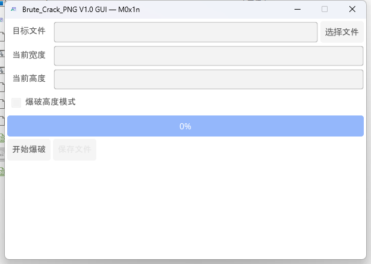
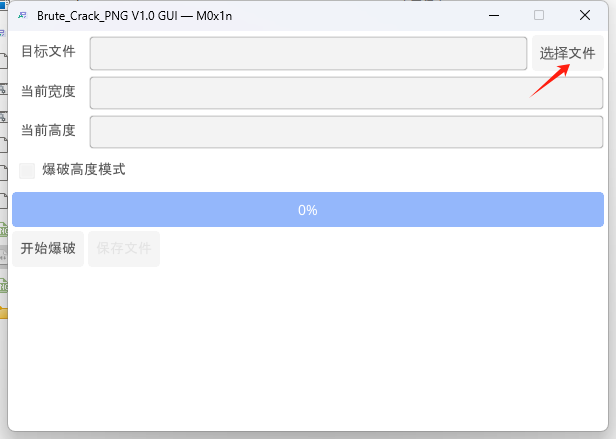
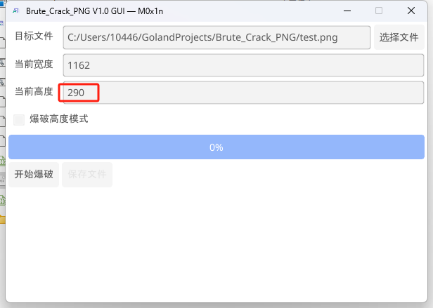
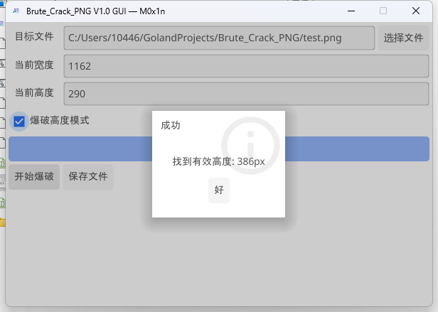
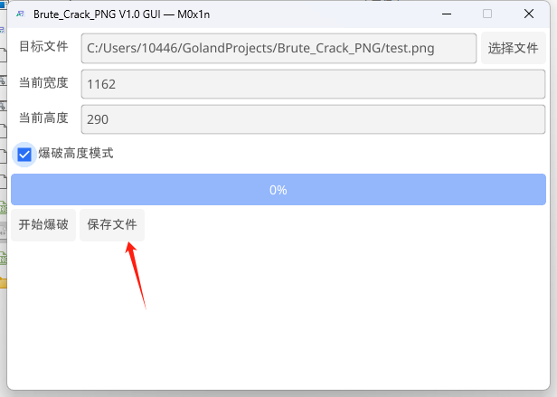
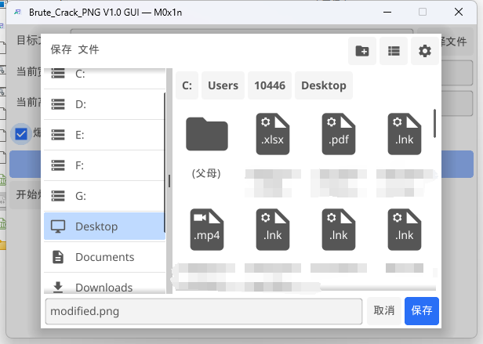
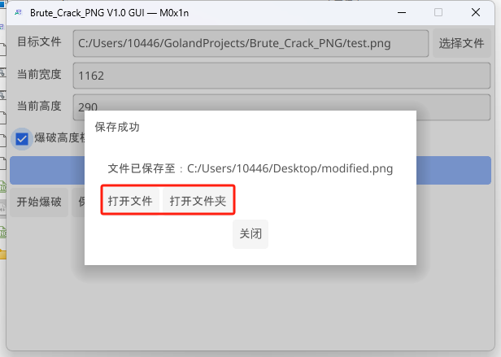
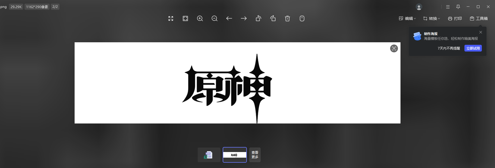
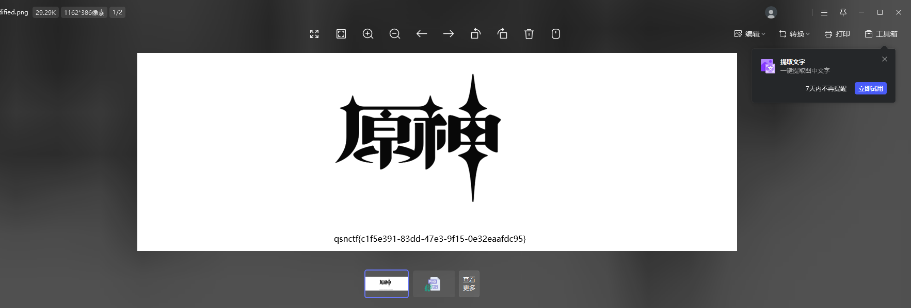

# 使用说明
通过CRC爆破PNG图片的宽度和高度
使用Golang重写的版本

# 使用方法
将需要宽高爆破的文件名改为test.png，在同路径下执行程序即可。

# GUI版本

GUI版本目前只支持Windows平台。

## 使用方法

选择一个被修改宽或高的PNG图片。

图中高度异常，选择爆破高度模式。

点击开始爆破，随后找到了一个有效高度386px

点击保存文件

可选打开文件、打开文件夹或者关闭。

修复效果如图所示：

**修复前：**

**修复后：**

